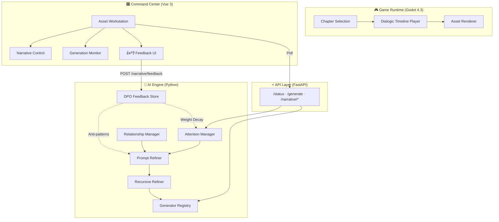
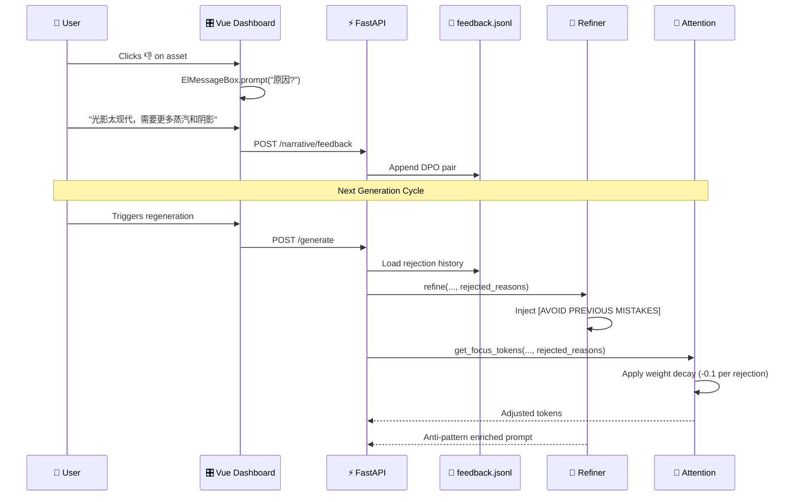

<p align="center">
  
  
  
  
  
</p>

<h1 align="center">🚂 Multilinear Narrative System</h1>
<h3 align="center">多线性叙事系统 · AI 驱动的互动叙事引擎</h3>

<p align="center">
  <i>一个融合了 <b>Attention 机制</b>、<b>社交关系权重</b>、<b>递归细化</b> 和 <b>DPO 人类反馈对齐</b> 的全栈叙事资产生产平台。</i>
</p>

<p align="center">
  <a href="#-architecture">Architecture</a> •
  <a href="#-features">Features</a> •
  <a href="#-quick-start">Quick Start</a> •
  <a href="#-ai-pipeline">AI Pipeline</a> •
  <a href="#-dpo-feedback-loop">DPO Loop</a> •
  <a href="#-tech-stack">Tech Stack</a>
</p>

---

## ✨ What is This?

This is not just another visual novel engine. It's a **full-stack AI-native narrative production system** that combines:

- 🎮 A **Godot 4.3+ game runtime** with chapterized branching dialogue
- 🧠 An **AI-powered asset generation pipeline** with recursive self-refinement
- 🎛️ A **Vue 3 command center** for real-time monitoring and narrative control
- 🔄 A **DPO (Direct Preference Optimization) feedback loop** that aligns AI output to human taste

> **Built for the story**: *Murder on the Orient Express (东方快车谋杀案)* — reimagined as a multilinear interactive experience.

---

## 🏗 Architecture



---

## 🎯 Features

### 🔮 Narrative Attention Mechanism
> *Inspired by Transformer self-attention — applied to storytelling.*

The system dynamically weighs narrative elements based on context:

| Token Type | Example | Purpose |
|-----------|---------|---------|
| **Global** | `(1930s Detective Mystery:1.2)` | Era & theme consistency |
| **Mood** | `(tense mood:1.25)` | Scene atmosphere detection |
| **Entity** | `<[HERO-POIROT-CONSISTENT]>` | Character identity anchoring |
| **Social** | `[SOCIAL: Tension=0.8]` | Relationship-driven tone |

### 👥 Social Relationship Weights
Characters have dynamic tension scores that affect AI generation:
```
Poirot ←→ Princess: Tension 0.7 (Respectful confrontation)
Poirot ←→ Ratchett: Tension 0.9 (Absolute hostility)
```

### 🔄 Recursive Self-Refinement
The AI critiques and improves its own prompts through multiple passes:
```
Pass 0: Initial Draft → "Train station at night..."
Pass 1: Critique → "Add more period-specific lighting details"
Pass 2: Critique → "Enhance mood contrast between warm interior and cold exterior"
Pass 3: Final → Rich, cinematically-refined prompt
```

### 🎯 DPO Human Feedback Alignment
```
User clicks 👎 → Inputs reason: "Too modern lighting"
    ↓
Stored in feedback.jsonl as DPO pair
    ↓
Next generation:
  • Refiner injects [AVOID PREVIOUS MISTAKES: Too modern lighting]
  • AttentionManager decays global weights (1.2 → 1.0)
  • Negative prompt updated with rejection reasons
    ↓
Result: AI learns from your taste in real-time
```

---

## 🚀 Quick Start

### Prerequisites
- **Python 3.10+** with FastAPI, Uvicorn
- **Node.js 18+** for the Vue 3 frontend
- **Godot 4.3+** for the game runtime

### 1. Start the AI Backend
```bash
cd foundation_platform
pip install fastapi uvicorn pydantic
python -m foundation_platform.api.api
# Server runs at http://localhost:8088
```

### 2. Launch the Command Center
```bash
cd editor-web
npm install
npm run dev
# Dashboard at http://localhost:5173
```

### 3. Run the Game
Open the project in Godot 4.3+ and press Play.

---

## 🤖 AI Pipeline

The generation pipeline follows a 3-stage process:

```
┌─────────────────┐    ┌──────────────────┐    ┌─────────────────┐
│  Stage 1/3      │    │  Stage 2/3       │    │  Stage 3/3      │
│  Deep Refinement│───▶│  AI Generation   │───▶│  Finalization   │
│                 │    │                  │    │                 │
│ • Attention     │    │ • Model dispatch │    │ • Metadata      │
│ • Social weight │    │ • Provider API   │    │ • Status update │
│ • DPO anti-pat  │    │ • Image/Audio gen│    │ • Cache warm    │
│ • Recursive loop│    │                  │    │                 │
└─────────────────┘    └──────────────────┘    └─────────────────┘
```

### Provider Registry
The system supports pluggable AI providers:

| Provider | Type | Status |
|----------|------|--------|
| `mock` | Placeholder generator | ✅ Active |
| `coze` | Coze AI Agent | 🔧 Ready |
| `comfyui` | ComfyUI Stable Diffusion | 📋 Planned |
| `suno` | Suno Music AI | 📋 Planned |

---

## 🔁 DPO Feedback Loop

The Direct Preference Optimization system creates a closed-loop between human judgment and AI generation:



---

## 📁 Project Structure

```
MultilinearNarrativeSystem/
├── foundation_platform/          # 🧠 AI Engine
│   ├── api/
│   │   └── api.py                # FastAPI endpoints
│   └── core/
│       ├── attention.py          # Narrative Attention Manager
│       ├── refiner.py            # Prompt Refiner + ICL
│       ├── generator.py          # Provider Registry
│       ├── relationships.py      # Social Weight Manager
│       └── extractor.py          # Asset Extractor
│
├── editor-web/                   # 🎛️ Vue 3 Command Center
│   └── src/
│       ├── components/
│       │   ├── AssetWorkstation.vue
│       │   ├── AssetCard.vue       # 👍/👎 DPO UI
│       │   └── NarrativeControl.vue # Social Matrix
│       └── App.vue
│
├── addons/dialogic/              # 🎮 Godot Dialogic Plugin
├── dialogic/
│   ├── characters/               # Character definitions
│   └── timelines/                # Chapterized dialogue trees
│
├── scripts/                      # 🛠️ Pipeline utilities
├── import_orient_express.py      # JSON → Timeline converter
├── fix_json.py                   # Node ID deduplication
└── feedback.jsonl                # 📊 DPO training data
```

---

## 🛠 Tech Stack

| Layer | Technology | Role |
|-------|-----------|------|
| **Game Runtime** | Godot 4.3 + GDScript | Interactive dialogue & visual novel |
| **Game Plugin** | Dialogic 2 | Timeline management & character system |
| **AI Backend** | Python + FastAPI | Asset generation pipeline |
| **AI Logic** | Custom Attention + DPO | Narrative-aware prompt engineering |
| **Frontend** | Vue 3 + Element Plus | Production command center |
| **Data** | JSON + JSONL | Narrative structure + feedback pairs |

---

## 📊 Development Phases

| Phase | Name | Status |
|-------|------|--------|
| 1 | Foundation Architecture | ✅ Complete |
| 2 | Task System Implementation | ✅ Complete |
| 3 | Workstation Live Update | ✅ Complete |
| 4 | Foundation Optimization v2.0 | ✅ Complete |
| 5 | Attention Mechanism | ✅ Complete |
| 6 | System Audit (Scout) | ✅ Complete |
| 7 | Narrative Structure Repair | ✅ Complete |
| 8 | Social Relationship Weights | ✅ Complete |
| 9 | Recursive Refinement | ✅ Complete |
| 10 | Observability & Control | ✅ Complete |
| 11 | Narrative Control Center | ✅ Complete |
| **12** | **DPO Feedback Alignment** | ✅ **Complete** |

---

## 📜 License

This project is licensed under the terms of the [MIT License](LICENSE).

Built with Godot Engine's [Dialogic 2](https://github.com/dialogic-godot/dialogic) plugin.

---

<p align="center">
  <sub>Built with ❤️ for interactive storytelling. Powered by AI, guided by human taste.</sub>
</p>
