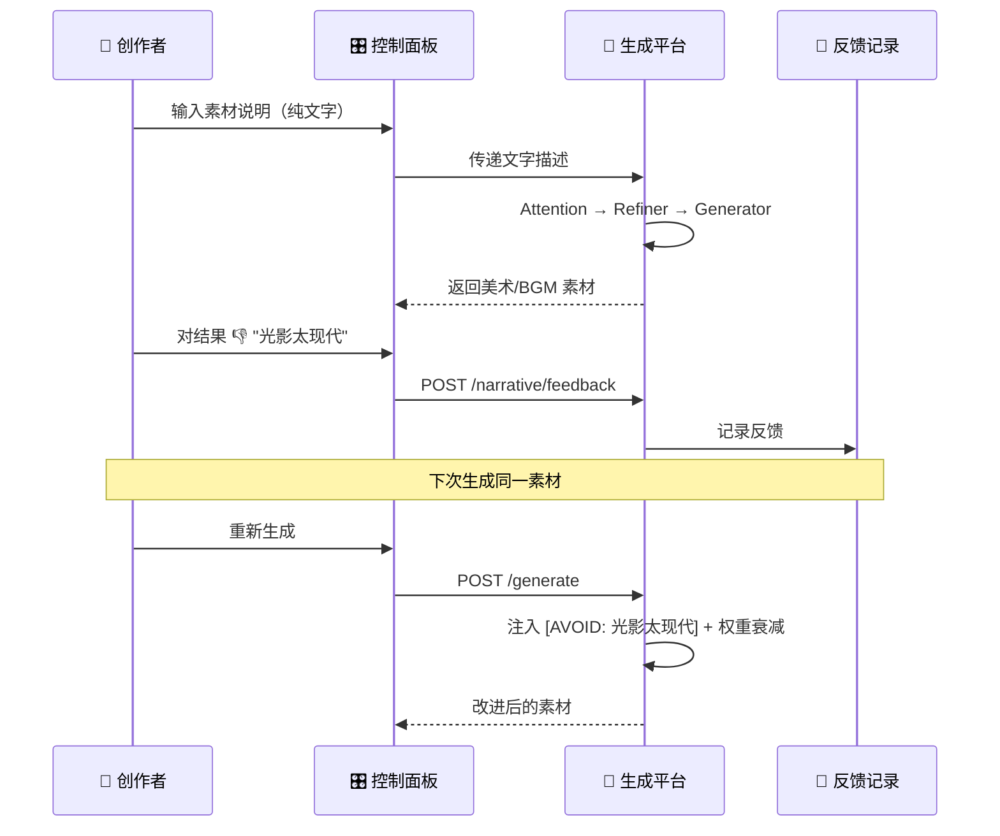

<p align="center">
  
  
  
  
  
</p>

<h1 align="center">🚂 Multilinear Narrative System</h1>
<h3 align="center">多线性叙事系统 · AI 驱动的互动叙事引擎</h3>

---

## 🗺️ 系统总览

本项目包含 **两个生产平台** + **一个游戏运行时**，三者协作完成从创意到成品的全流程：

```
  ┌──────────────────────────────┐       ┌──────────────────────────────┐
  │  🧠 素材提取与生成平台          │       │  🎛️ 内容设计与编辑平台          │
  │  foundation_platform/         │       │  editor-web/                  │
  │                               │       │                              │
  │  输入: 文字素材说明（大纲）      │       │  功能: 叙事流程图、节点编辑     │
  │    · 角色：波洛、公主、布克      │       │  输出: JSON（叙事结构数据）     │
  │    · 场景：车站夜景、餐车        │       │                              │
  │    · BGM：紧张、优雅、悬疑      │       └────────────┬─────────────────┘
  │                               │                     │
  │  输出: 美术 + 音乐素材          │                     ▼
  │    · 背景图 / 人物立绘 / BGM   │           东方快车谋杀案修复版.json
  │                               │                     │
  │  ← 用户 👍/👎 反馈调整 →       │                     │
  └────────────┬──────────────────┘                     │
               │                                        │
               ▼                                        │
         assets/ (图/音)                                 │
               │                                        │
               └───────────────┬────────────────────────┘
                               ▼
                      ┌─────────────────────┐
                      │  🎮 游戏运行时        │
                      │  Godot 4.3 + Dialogic│
                      │                     │
                      │  加载 JSON + 素材     │
                      │  → 可玩的互动小说      │
                      └─────────────────────┘
```

---

## 🧠 素材提取与生成平台（`foundation_platform/`）

> **AI 驱动的游戏资产工厂。** 创作者只需用文字列出需要的角色、场景、音乐，平台自动提取需求并生成美术和音频素材。**本平台已完全脱离 JSON，实现纯文字大纲 → 资产的解耦。**

### 核心管线：NAR (Narrative Attention Residuals) 缝合模型

> **学术机制集成**: 参考 Kimi Team 2026 最新论文 [Attention Residuals](https://arxiv.org/abs/2603.15031)，用 **softmax 深度注意力** 替代固定权重的残差累加。

| NAR 层级 | 说明 | 对应论文机制 |
|------|------|-------------|
| **Pipeline NAR** | 跨阶段信息检索。精炼器通过注意回溯，从全局配置和提取阶段自动获取上下文。 | Cross-layer Attention |
| **Recursive NAR** | 跨轮次信息强化。多轮精炼过程中，每一轮都回溯所有前序轮次，防止信息由于“深度”增加而稀释。 | Multi-pass Attention Residuals |
| **Temporal NAR** | 跨会话反馈召回。基于内容相关性，从 DPO 历史中自动检索并应用最相关的 👍/👎 反馈。 | Temporal Depth-wise Attention |

### 它做了什么？

| 步骤 | 说明 |
|------|------|
| **1. 接收纯文字大纲** | 通过 `/assets/register` 接口，解析 `角色：... 场景：...` 格式的中文文本并自动提取需求。 |
| **2. 注意力聚焦 (Stage 1)** | 分析文字，分配叙事权重（时代、情绪、角色特征），结果推入 NAR 栈。 |
| **3. 提示词精炼 (Stage 2)** | 利用 **NAR 机制** 回溯历史反馈和前序阶段，生成具备叙事连贯性的 AI Prompt。 |
| **4. 递归细化 (Stage 3)** | 多轮精炼使用 **Recursive NAR** 强化早期轮次，防止高熵值下的特征丢失。 |
| **5. AI 生成 (Stage 4)** | 调用 AI 模型生成图片或音频，结果存储于相应的 `assets/` 目录。 |

### 核心流程

```
  输入（纯文字）                                             输出（素材文件）
 ┌──────────────────┐                                    ┌──────────────────┐
 │ 角色：波洛         │    Attention     Refiner          │ poirot.png       │
 │   灰色胡须的比利时  │ →  注意力聚焦  →  提示词精炼  → AI → │ station_night.png│
 │ 场景：车站夜景      │    (1930s:1.1)    (+ cinematic)    │ tense_bgm.mp3    │
 │   寒冷，蒸汽弥漫   │                                    └──────────────────┘
 └──────────────────┘                       ↑
                                      DPO 反馈闭环
                                  👎 "太现代" → 自动规避
```

### 特色机制

| 机制 | 说明 |
|------|------|
| **Narrative Attention** | 模仿 Transformer 自注意力，根据情绪/角色/时代为 Prompt 分配权重 |
| **Social Weights** | 角色间社交关系（张力/亲密度）影响生成的视觉语气 |
| **Recursive Refinement** | AI 自我评审多轮迭代，逐步提升 Prompt 质量 |
| **DPO Feedback** | 用户 👍/👎 → 负面反馈注入 anti-pattern → 权重衰减 → 下次自动规避 |

### 目录结构

```
foundation_platform/              ← 纯文字驱动的素材工厂
├── api/
│   └── api.py                # FastAPI 服务 (端口 8088/8092) [NAR-ENABLED]
└── core/
    ├── nar.py                # 🧩 NAR 核心引擎（Softmax 深度注意力）
    ├── extractor.py          # 📦 文字大纲解析器（括号感知、内容解耦）
    ├── attention.py          # 🎯 注意力管理器（叙事权重分发）
    ├── refiner.py            # ✨ Recursive NAR 精炼器
    ├── relationships.py      # 👥 社交关系偏置矩阵
    └── generator.py          # 🏭 AI 生成器（美术/音乐）
```

### 启动

```bash
pip install fastapi uvicorn pydantic
python -m foundation_platform.api.api   # http://localhost:8088
```

---

## 🎛️ 内容设计与编辑平台（`editor-web/`）

> **叙事结构的可视化编辑器。** 创作者在这里设计故事的分支、对话、选项，最终导出 JSON 供游戏引擎使用。

### 它做了什么？

| 功能 | 说明 |
|------|------|
| **流程图编辑** | 多线性分支的可视化拖拽设计 |
| **节点编辑** | 对话、选择、跳转等节点的属性配置 |
| **素材管理** | 资产生产指挥台（盘点/批量生成/实时监控） |
| **叙事控制** | 社交关系矩阵 / 全局注意力参数调节 |
| **DPO 反馈** | 对已生成素材进行 👍/👎，驱动生成平台优化 |
| **JSON 导出** | 输出叙事结构 JSON，供 Godot 游戏引擎消费 |

### 关键组件

```
editor-web/src/components/
├── FlowCanvas.vue           # 🔀 章节流程图（多线性分支可视化）
├── NodeCanvas.vue           # 📝 节点编辑画布
├── EditorPage.vue           # 🎬 叙事编辑器主页
├── AssetWorkstation.vue     # 📊 资产生产指挥中心
├── AssetCard.vue            # 🃏 素材卡片（预览 + 👍/👎）
└── NarrativeControl.vue     # 🕸️ 叙事控制（社交矩阵/参数调节）
```

### 启动

```bash
cd editor-web
npm install
npm run dev   # http://localhost:5173
```

---

## 🎮 游戏运行时（Godot + Dialogic）

> **最终玩家体验的互动视觉小说。** 读取编辑平台导出的 JSON 和生成平台产出的资产，渲染为可玩的游戏。

| 目录 | 内容 |
|------|------|
| `addons/dialogic/` | Dialogic 2 插件 |
| `dialogic/characters/` | 角色定义 (`.dch`) |
| `dialogic/timelines/` | 章节对话树 (`.dtl`) |
| `assets/` | 背景图、人物立绘、BGM |
| `scripts/main.gd` | 游戏主逻辑 |

**启动**：Godot 4.3+ 打开 `project.godot` → F5

---

## 🔁 DPO 反馈闭环



---

## 📊 开发阶段

| 阶段 | 名称 | 子系统 | 状态 |
|------|------|--------|------|
| 1 | 基础架构设计 | 🧠 生成平台 | ✅ |
| 2 | 任务系统实现 | 🧠 生成平台 | ✅ |
| 3 | 工作站实时更新 | 🎛️ 编辑平台 | ✅ |
| 4 | 基础优化 v2.0 | 🧠 生成平台 | ✅ |
| 5 | Attention 注意力机制 | 🧠 生成平台 | ✅ |
| 6 | 系统审计 (Scout) | 全局 | ✅ |
| 7 | 叙事结构修复 | 🎮 游戏运行时 | ✅ |
| 8 | 社交关系权重 | 🧠 生成平台 | ✅ |
| 9 | 递归细化机制 | 🧠 生成平台 | ✅ |
| 10 | 观测与控制 | 🎛️ 编辑平台 | ✅ |
| 11 | 叙事控制中心 | 🎛️ 编辑平台 | ✅ |
| 12 | DPO 人类反馈对齐 | 🧠 + 🎛️ | ✅ |
| **13** | **素材平台 JSON 解耦** | **🧠 生成平台** | ✅ |
| **14** | **NAR 机制 (AttnRes 缝合)** | **🧠 生成平台** | ✅ |
| **15** | **生产就绪与最终交付** | **全局** | ✅ |

---

## 🛠 技术栈

| 层级 | 技术 | 用途 |
|------|------|------|
| 游戏引擎 | Godot 4.3 + GDScript | 互动对话 & 视觉小说 |
| 对话插件 | Dialogic 2 | 时间线管理 & 角色系统 |
| AI 后端 | Python + FastAPI | 资产生成管线 |
| AI 逻辑 | Attention + DPO | 叙事感知 Prompt 工程 |
| 前端 | Vue 3 + Element Plus | 编辑平台 & 生产指挥 |
| 数据 | JSON + JSONL | 叙事结构 + 反馈对 |

---

## 📜 License
MIT License. Built with [Dialogic 2](https://github.com/dialogic-godot/dialogic).

<p align="center">
  <sub>Built with ❤️ for interactive storytelling. Powered by AI, guided by human taste.</sub>
</p>
