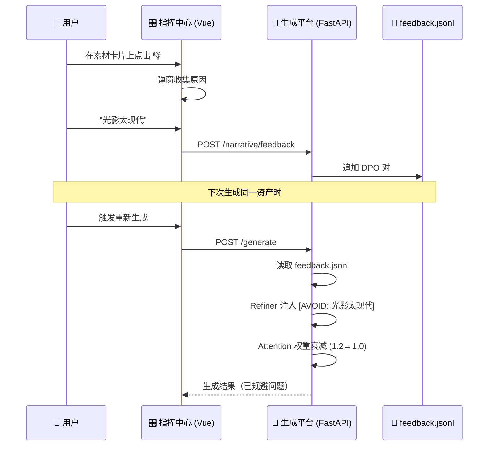

<p align="center">
  
  
  
  
  
</p>

<h1 align="center">🚂 Multilinear Narrative System</h1>
<h3 align="center">多线性叙事系统 · AI 驱动的互动叙事引擎</h3>

---

## 🗺️ 本仓库包含三个子系统

```
本仓库（MultilinearNarrativeSystem）
│
├── 🎮 ① 游戏运行时 ─── Godot 4.3 + Dialogic 插件（互动视觉小说）
│
├── 🧠 ② 素材提取生成平台 ─── foundation_platform/（AI 驱动的资产工厂）  ⬅️ 核心
│
└── 🎛️ ③ 可视化指挥中心 ─── editor-web/（Vue 3 生产控制台 + 叙事编辑器）
```

下面逐一介绍 👇

---

## 🎮 ① 游戏运行时（Godot + Dialogic）

**用途**：最终玩家运行的互动视觉小说。

| 目录 | 内容 |
|------|------|
| `addons/dialogic/` | Dialogic 2 插件（对话/分支系统） |
| `dialogic/characters/` | 角色定义文件 (`.dch`) |
| `dialogic/timelines/` | 章节化对话树 (`.dtl`) |
| `scripts/main.gd` | 游戏主逻辑 |
| `scenes/` | Godot 场景文件 |
| `assets/` | 背景图、人物立绘、BGM 等资产 |
| `东方快车谋杀案修复版.json` | 叙事数据源（全部节点 + 分支） |

**启动方式**：用 Godot 4.3+ 打开 `project.godot`，按 F5 运行。

---

## 🧠 ② 素材提取生成平台（`foundation_platform/`）

> **这是本项目的 AI 核心。** 负责从叙事 JSON 中提取所有资产需求，然后用 AI 自动生成缺失的素材。

```
foundation_platform/          ⬅️ 素材提取生成平台
├── api/
│   └── api.py                 # FastAPI 服务 (端口 8088)
│                               # /status   — 资产盘点（已有/缺失）
│                               # /generate — 触发 AI 生成任务
│                               # /narrative/config   — 全局叙事控制
│                               # /narrative/feedback — DPO 反馈收集
│
└── core/
    ├── extractor.py           # 📦 资产提取器：解析 JSON → 列出所有资产路径和描述
    ├── attention.py           # 🎯 注意力管理器：为每个资产计算叙事权重
    ├── refiner.py             # ✨ 提示词精炼器：将原始描述 → 高质量 AI Prompt
    ├── relationships.py       # 👥 社交关系管理：角色间张力影响生成语气
    └── generator.py           # 🏭 生成器注册表：Mock / Coze / ComfyUI 等 AI 供应商
```

### 核心流程

```
东方快车谋杀案修复版.json
        │
        ▼
  ┌─────────────┐      ┌──────────────┐      ┌──────────────┐
  │  Extractor   │─────▶│  Attention   │─────▶│   Refiner    │
  │  资产提取     │      │  注意力聚焦   │      │  提示词细化   │
  │              │      │              │      │              │
  │ 输出:        │      │ 输出:        │      │ 输出:        │
  │ 56个资产路径  │      │ 叙事权重Token │      │ 精炼后Prompt  │
  └─────────────┘      └──────────────┘      └──────────────┘
                                                     │
                                                     ▼
                                              ┌──────────────┐
                                              │  Generator   │
                                              │  AI 生成器    │
                                              │  Mock/Coze   │
                                              │  → 输出图片   │
                                              └──────────────┘
```

### 特色机制

| 机制 | 说明 |
|------|------|
| **Narrative Attention** | 模仿 Transformer 自注意力，根据场景情绪/角色/时代为 Prompt 分配权重 |
| **Social Weights** | 角色间社交关系（张力/亲密度）影响生成的视觉语气 |
| **Recursive Refinement** | AI 自我评审 → 多轮迭代打磨 Prompt 质量 |
| **DPO Feedback** | 用户 👍/👎 → 负面反馈注入 anti-pattern → 权重衰减 → 下次生成自动规避 |

### 启动方式
```bash
pip install fastapi uvicorn pydantic
python -m foundation_platform.api.api
# 服务运行在 http://localhost:8088
```

---

## 🎛️ ③ 可视化指挥中心（`editor-web/`）

> Vue 3 + Element Plus 构建的浏览器控制台，**既是素材生产的管理面板，也是叙事结构的可视化编辑器**。

```
editor-web/src/
├── App.vue                    # 主应用（Tab 路由）
├── components/
│   ├── AssetWorkstation.vue   # 📊 资产生产指挥中心（盘点/批量生成/监控）
│   ├── AssetCard.vue          # 🃏 资产卡片（预览 + 👍/👎 DPO 反馈）
│   ├── NarrativeControl.vue   # 🕸️ 叙事控制中心（社交矩阵/全局参数调节）
│   ├── FlowCanvas.vue         # 🔀 章节流程图（多线性分支可视化）
│   ├── NodeCanvas.vue         # 📝 节点编辑画布
│   └── EditorPage.vue         # 🎬 叙事编辑器主页
```

### 启动方式
```bash
cd editor-web
npm install
npm run dev
# 浏览器打开 http://localhost:5173
```

---

## 🔁 DPO 反馈闭环

三个子系统之间的数据流：



---

## 📁 完整目录结构

```
MultilinearNarrativeSystem/
│
│  ── 🧠 ② 素材提取生成平台 ──────────────────────────
├── foundation_platform/
│   ├── api/api.py              # FastAPI 服务端
│   └── core/
│       ├── extractor.py        # 资产提取
│       ├── attention.py        # 注意力权重
│       ├── refiner.py          # Prompt 精炼 + ICL
│       ├── generator.py        # AI 生成器
│       └── relationships.py    # 社交权重
│
│  ── 🎛️ ③ 可视化指挥中心 ──────────────────────────────
├── editor-web/
│   └── src/components/
│       ├── AssetWorkstation.vue # 生产指挥台
│       ├── AssetCard.vue       # 素材卡片 + DPO
│       ├── NarrativeControl.vue# 叙事控制
│       └── FlowCanvas.vue      # 流程图编辑
│
│  ── 🎮 ① 游戏运行时 ─────────────────────────────────
├── addons/dialogic/            # Dialogic 插件
├── dialogic/                   # 角色 & 时间线
├── scripts/                    # Godot 脚本
├── scenes/                     # 场景文件
├── assets/                     # 资产文件（图/音）
│
│  ── 📄 数据 & 工具 ──────────────────────────────────
├── 东方快车谋杀案修复版.json     # 叙事数据源
├── import_orient_express.py    # JSON → Dialogic 转换器
├── fix_json.py                 # 节点 ID 去重
├── feedback.jsonl              # DPO 训练数据
└── README.md                   # 你正在看的这个文件
```

---

## 📊 开发阶段

| 阶段 | 名称 | 子系统 | 状态 |
|------|------|--------|------|
| 1 | 基础架构设计 | ② 生成平台 | ✅ |
| 2 | 任务系统实现 | ② 生成平台 | ✅ |
| 3 | 工作站实时更新 | ③ 指挥中心 | ✅ |
| 4 | 基础优化 v2.0 | ② 生成平台 | ✅ |
| 5 | Attention 注意力机制 | ② 生成平台 | ✅ |
| 6 | 系统审计 (Scout) | 全局 | ✅ |
| 7 | 叙事结构修复 | ① 游戏运行时 | ✅ |
| 8 | 社交关系权重 | ② 生成平台 | ✅ |
| 9 | 递归细化机制 | ② 生成平台 | ✅ |
| 10 | 观测与控制 | ③ 指挥中心 | ✅ |
| 11 | 叙事控制中心 | ③ 指挥中心 | ✅ |
| **12** | **DPO 人类反馈对齐** | **② + ③** | ✅ |

---

## 🛠 技术栈

| 层级 | 技术 | 用途 |
|------|------|------|
| 游戏引擎 | Godot 4.3 + GDScript | 互动对话 & 视觉小说 |
| 对话插件 | Dialogic 2 | 时间线管理 & 角色系统 |
| AI 后端 | Python + FastAPI | 资产生成管线 |
| AI 逻辑 | Attention + DPO | 叙事感知的 Prompt 工程 |
| 前端 | Vue 3 + Element Plus | 生产指挥中心 |
| 数据 | JSON + JSONL | 叙事结构 + 反馈对 |

---

## 📜 License
MIT License. Built with [Dialogic 2](https://github.com/dialogic-godot/dialogic).

<p align="center">
  <sub>Built with ❤️ for interactive storytelling. Powered by AI, guided by human taste.</sub>
</p>
