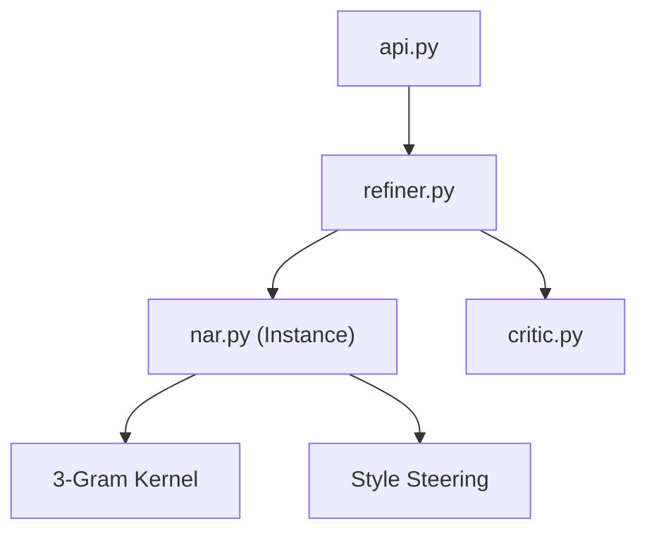

# NAR Engine: Architectural Disassembly & Vulnerability Audit

## 🏗️ Current Topology (v18.0)
The NAR engine currently operates as a **Transient Utility Stack** orchestrated by the `PromptRefiner`. 

## 🔍 Identified Architectural "Loopholes"

### 1. Stateless Volatility (The "Amnesia" Problem)
**Status**: Critical
**Finding**: The `NarrativeAttentionResidual` instance is instantiated *inside* `refiner.refine()`. 
**Impact**: Every asset generation starts with a completely blank slate. There is no persistent "Narrative World-State" that links the Knight to the Dragon unless the user manually threads `nar_context` strings.
**Roadmap**: Transition from Transient Stack to a **Shared Narrative Memory Buffer (SNMB)**.

### 2. Linear Accumulation vs. Distillation
**Status**: High
**Finding**: The stack grows linearly. While `temporal decay` helps, the system never *compresses* or *summarizes* established narrative facts.
**Impact**: Over long refinement loops or large sessions, "Attention Dilution" occurs. The engine spends too much energy attending to raw historical text rather than "Narrative Premise" abstractions.

### 3. Heuristic Brittleness (Syntactic vs. Semantic)
**Status**: Medium
**Finding**: The similarity kernel relies on character 3-gram overlap.
**Impact**: It is excellent for keyword stability but fails on **Conceptual Synonyms**. "Darkness" and "Obscurity" have zero 3-gram overlap, leading to a failure of Level 2 NAR retrieval for related but differently phrased concepts.

### 4. Post-Hoc Criticism
**Status**: Medium
**Finding**: The `NarrativeCritic` is a "Final Gatekeeper".
**Impact**: It detects errors *after* they are fully baked into the prompt. If pass 2 of a recursive loop diverges, passes 3-5 build on that error, and the critic only flags it at the end, leading to wasted refinement cycles.

## 🚀 The Road to v19.0: "World-State NAR"
To fix these, we should move towards:
- **Persistent Asset-Graph NAR**: Linking stacks across related assets.
- **Narrative Distillation**: Periodically summarizing the stack into "World Facts".
- **Semantic Vector Map**: Using a lightweight embedding proxy.
